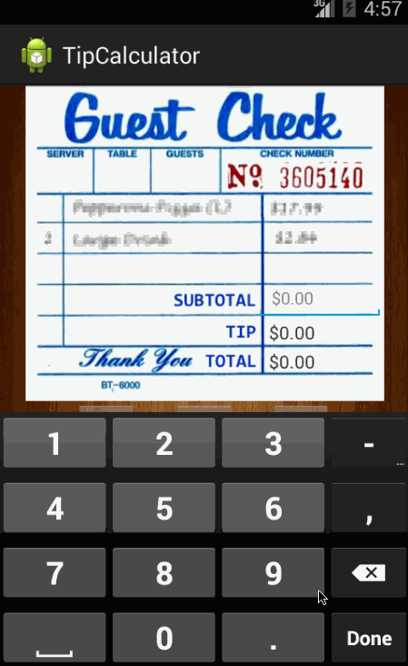

# Android Tip Calculator App

This is a basic app that allows a user to calculate how much to tip given a particular subtotal.

Time spent: 3 hours

Completed user stories:

 * [x] Required: User is displayed the tip of specified percentage for specified entered amount
 * [x] Required: User enters the total amount of the transaction
 * [x] User can select between tip amounts (i.e 10%, 15%, 20%)
 * [x] Upon selecting tip amount, formatted tip value is displayed
 * [x] Optional: User changes the total amount and updated tip is reflected automatically
 * [ ] Optional: User can select custom tip percentage if desired
 * [ ] Optional: User can select how many ways to split the tip
 * [x] Optional: Tip selection persists across launches
 * [ ] Optional: Experiment with trying input widgets to replace the buttons and/or textviews
 * [x] Optional: Improve the user interface and experience by using images and/or colors
 

Walkthrough of all user stories:

GIF created with [LiceCap](http://www.cockos.com/licecap/).
